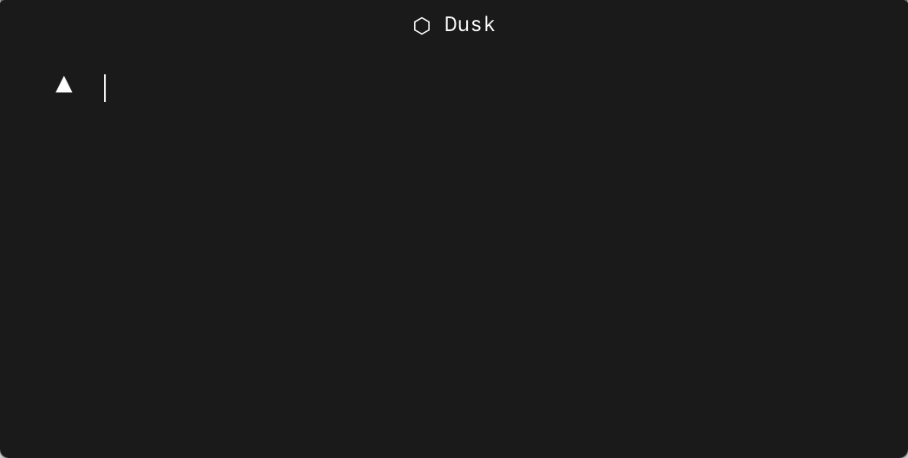
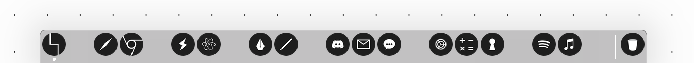

# Dusk

simple, customizable macOS application icons.

<p align="center">
  
  
  
</p>

## Install

Dusk icons can be used from the command line, via the [Dusk website](https://dusk.now.sh), or as React components [(dusk-react)](https://github.com/pacocoursey/dusk-react).

### CLI [](https://badge.fury.io/js/dusk-icons)

Install the command line tool using npm:

```bash
$ [sudo] npm install -g dusk-icons
```

Then run `dusk-icons` from the command line. Enter a list of comma separated icons.

<p align="center">
  
</p>

## Contributing

For info on how to contribute to Dusk, please see the [contribution guidelines](https://github.com/pacocoursey/dusk/blob/master/CONTRIBUTING.md).

## Examples




## Related

- [LiteIcon](https://freemacsoft.net/liteicon/): app which allows you to change your system icons.
- [Feather](https://github.com/colebemis/feather): Simple, beautiful open source icons.

## Icons

| Application | Icon Name | Alternates |
| :---------- | :-------- | :--------- |
| Activity Monitor    | `activity_monitor`  |
| Anki | `anki` |
| Adobe Illustrator | `illustrator` |
| Adobe Photoshop | `photoshop` |
| App Store | `app_store` |
| Atom | `atom` |
| Books | `books` |
| Calculator | `calculator` |
| Calendar | `calendar` |
| Camera | `camera` |
| Chess | `chess` |
| Console | `console` |
| Contacts | `contacts` |
| Dashboard | `dashboard` |
| Dictionary | `dictionary` |
| Discord | `discord` |
| Dotgrid | `dotgrid` |
| Dropbox | `dropbox` |
| Electron | `electron` |
| Enpass | `enpass` |
| Facetime | `facetime` |
| Finder | `finder` | `finder2`, `finder3`
| Firefox | `firefox` |
| Font Book | `font_book` |
| Framer | `framer` |
| Franz | `franz` |
| Google Chrome | `chrome` | `chrome2`
| Hyper | `hyper` |
| iMovie | `imovie` |
| iTerm2 | `iterm2` |
| iTunes | `itunes` |
| Launchpad | `launchpad` |
| Left | `left` |
| Mail | `mail` |
| Maps | `maps` |
| Messages | `messages` |
| Microsoft Teams | `teams` |
| News | `news` |
| Notes | `notes` |
| Notion | `notion` |
| Numbers | `numbers` |
| Pages | `pages` |
| Photos | `photos` |
| Reminders | `reminders` |
| Safari | `safari` |
| Skype | `skype` |
| Slack | `slack` |
| Spotify | `spotify` |
| System Preferences | `system_preferences` |
| Telegram | `telegram` |
| Terminal | `terminal` |
| Todoist | `todoist` |
| Trash | `trash` |
| Trello | `trello` |
| VSCode | `vscode` |
| Xcode | `xcode` |
